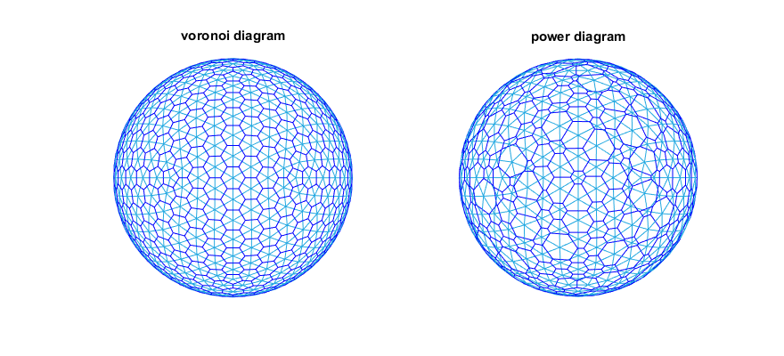

# spherical power diagram
compute power diagram (Laguerre Voronoi Diagram) on the sphere as described in [this][jgg0606] paper, code translated from [Kokichi Sugihara][Sugihara]'s fortran code

## demo

see demo.m for steps to generate above results.

  [Sugihara]: <http://home.mims.meiji.ac.jp/~sugihara/opensoft/opensofte.html>
  [jgg0606]: <http://www.heldermann-verlag.de/jgg/jgg06/jgg0606.pdf>